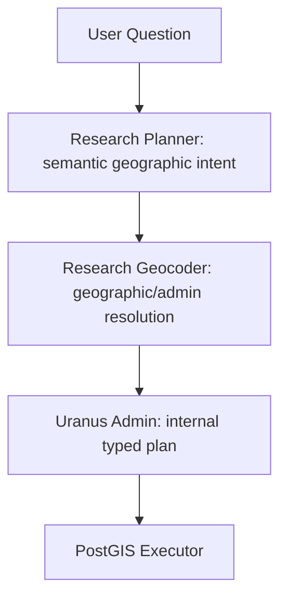

# Administrative geography: v8 / prompt v14

## Responsibility boundary

The diagram assigns responsibility; Admin owns the actual network orchestration.
The Planner answers what the user means, never which OSM object a name denotes.
It supplies no AGS, district key, OSM ID, coordinate, boundary or resolved reference.
Admin normalizes the wire plan before resolution and execution.

## Audit of v7 / v13

The audited v13 base is commit `40fb85d` in predecessor PR #20. The fetched main
at audit time was `2710c57` (v12). Uncommitted local v13 changes were not included.

- `EntityV7`: event, occurrence, venue, space, organization, municipality, region.
  Country was a dimension/group, but not an explicit subject; district/state absent.
- `DimensionV7` and `GroupingV7`: municipality, region and country, alongside the
  existing non-geographic dimensions. Counties/states could only become generic
  regions or be unsupported.
- `SpatialV7`: one nullable object, named `area_query` or `place_query`, relation,
  radius and reference. No expected administrative level.
- `inside`/`outside`: administrative area membership through `area_query`.
  `near_border`/`across_border`: border references; near-border distance requires
  a radius or a blocking definition. Outside membership is not a border intent.
- A single spatial object cannot faithfully express outside one area AND inside
  another. That remains a v7 capability gap; v7 has not been retroactively widened.

Legacy schema snapshots, prompt and endpoint remain frozen. The new stable wire
endpoint is `/v8/plan`, `research-query-plan-v8`, prompt `research-planner-v14`.
The v8 vocabulary/models live in the corresponding `research_v8_*` files, keeping
versioned wire definitions separate from Admin's execution models.

## New contract

Administrative subjects, distinct-count dimensions and groups explicitly support
`municipality`, `district`, `state`, `country`, `region`. Region means a generic or
non-official region; it is not a fallback spelling for state or district.

`SpatialV8.area_level` is required-but-nullable, matching native structured-output
rules. It is an expected level, not a verified classification. Explicit Kreis or
Landkreis requires district; Bundesland requires state; Gemeinde/Stadt requires
municipality. An unambiguous known name may imply a level. The Geocoder remains
authoritative and Admin must reject mismatches rather than rewrite either meaning.

`spatial` is a list of zero to four closed constraints. They are ANDed. More than
one constraint is supported only for inside/outside membership, not arbitrary
Boolean, distance or border composition. An empty list means no spatial constraint.
Duplicate constraints, unknown fields, Boolean DSL objects and over-limit lists
are invalid. Requests outside that algebra must retain an explicit unsupported
state; no predicate may silently disappear.

| Question | Subject / grouping | Spatial / metric |
| --- | --- | --- |
| Veranstaltungen außerhalb von Schleswig-Holstein | event / none; list | outside, state, named |
| Veranstaltungen im Kreis Schleswig-Flensburg | event / none; list | inside, district, named |
| Veranstaltungen in Flensburg | event / none; list | inside, municipality, named |
| Landkreise mit den meisten Veranstaltungen | district / district; rank | event_count, desc |
| Bundesländer mit den meisten Kulturveranstaltungen | state / state; rank | event_count; category eq Kultur |
| Gemeinden im Kreis Nordfriesland ohne Veranstaltungen | municipality / municipality; aggregate | inside district Nordfriesland; event_count eq 0 |
| Außerhalb Schleswig-Holsteins, innerhalb Deutschlands | event / none; list | outside state AND inside country |
| Veranstaltungen in Norddeutschland | event / none; list | inside generic region |

The parent area constrains the administrative subject inventory when grouping
children. It never replaces the municipality subject with the district. An exact
zero count needs a complete inventory and source population in Admin; the Planner
does not claim to possess either.

## Tests and safety

`tests/fixtures/v8_administrative.json` contains 13 reviewed complete wire witnesses,
shared with Admin. Contract tests cover area levels, grouping, missing codes/IDs,
rank consistency, bounded conjunctions and schema closure. Mocked single-model-
request tests verify the transport/output boundary, not live language accuracy.
The existing v7 geography and regression corpus remains unchanged.

Run CI: ruff, format check, mypy, pytest, `scripts/export_openapi.py` with snapshot
comparison, `scripts/check_doc_links.py`, and `git diff --check`. Both OpenAPI and
the v8 JSON schema are checked in. No live model or Geocoder probe was performed.
One model request, zero retries, no tools and no semantic/execution fallback remain.

## Integration limits

v8 preserves the full declarative language, while Admin's initial new execution
path intentionally rejects unimplemented combinations rather than dropping them.
Administrative membership/list/count, event-count administrative ranking, one exact
category and zero-count child discovery are implemented there. Other temporal,
semantic, price, border or analytical compositions need additional normalizer and
executor support. v7 callers must upgrade explicitly for multi-area semantics.

## Stack integration with v9

PR #21 was rebased from common ancestor
`56a6a5e56f7e5eaaf075587a5495e253ef9c0a14` onto PR #20 head
`73fa2edad9eab01bca6d8c013c07740ac11c84ec`. At this rebase, PR #20 is still
open and main remains `2710c57c228bac954ad3acb51a9473ced9119bff`. PR #21 therefore
keeps PR #20's branch as its base. Merge #20 first, then retarget to main.

The conflicts in `app.py`, `model_client.py` and `planner.py` were resolved by
retaining both explicitly typed versions. V8 uses its original administrative
schema, canonicalizer and prompt; v9 retains its reviewed multidimensional schema,
canonicalizer and prompt. Both agents share the existing model, SDK and bounded
HTTP client. OpenAPI was regenerated from the combined application, preserving
every existing path and schema component unchanged.

All seven endpoints coexist: `/plan`, `/v4/plan`, `/v5/plan`, `/v6/plan`,
`/v7/plan`, `/v8/plan`, `/v9/plan`. V7 remains schema v7 / prompt v13; v8 uses
schema v8 / prompt v14; v9 uses schema v9 / prompt v15. No contract is renamed or
converted into another version.

The original v8 endpoint was missing from the shared request-boundary path lists.
It now receives the same service-key authentication, body bounds and request
checks as the other versions. Integration tests in
`tests/test_research_version_coexistence.py` cover separate dispatch and envelopes,
cross-version rejection, exact query identity, safe errors, shared admission and
timeout handling, one shared provider stack, and no retries/tools/fallback.

This rebase does not change language-acceptance evidence, activate a production
contract, or deploy any service. V9's existing preview/acceptance caveats remain.

Rebase validation: the full offline suite passed with **4586 passed, 710 skipped**.
The focused v8/v9/coexistence suite passed **560 tests**. Ruff, format checking,
Mypy (41 source files), OpenAPI regeneration/reproducibility, local documentation
links and `git diff --check` passed. Optional live tests remained disabled.
