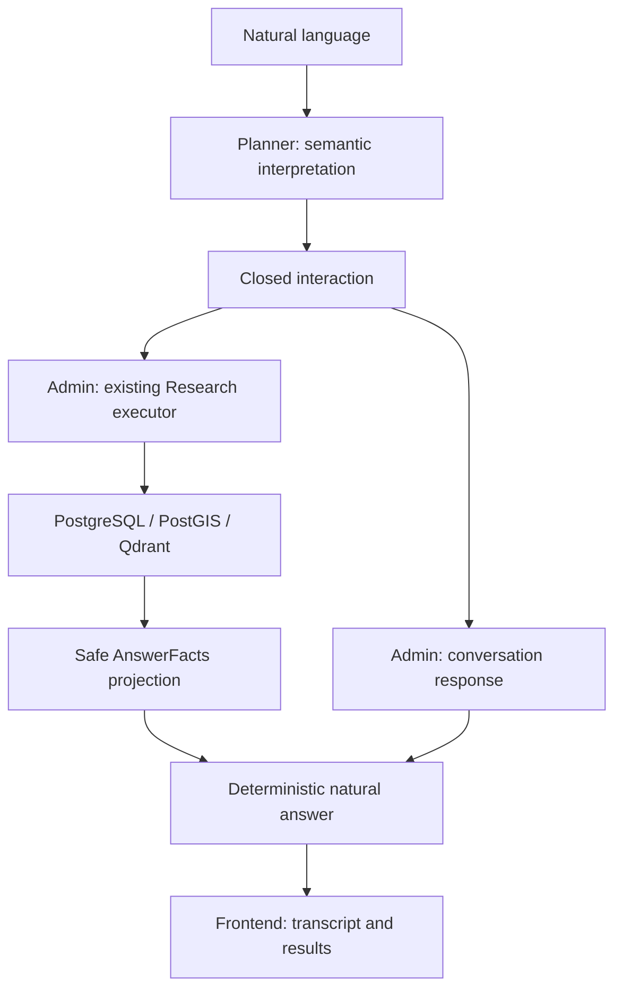

# Conversational Research v13

`POST /v13/plan` is additive: `research-query-plan-v13`, prompt
`research-planner-v19`. v12/v18 and every previous endpoint keep their original
schemas and prompts. Baseline: `a3faf329bdbf4f0586ab235152f44277780e82a1`.



The model interprets language. PostgreSQL/PostGIS remain authoritative for facts,
identities, eligibility, dates and counts; Qdrant ranks eligible semantic matches.
Admin owns execution, short-lived conversation state and factual answer projection.
The frontend renders responses and submits the current text and an opaque ID.

## Closed wire

The model returns `original_query`, `language` (`de`, `da`, `en`) and `interaction`.
The HTTP envelope adds versions, model provenance, local reference date, timezone
and safe timing diagnostics. Both the model adapter and API revalidate the output.

| `interaction.kind` | Payload / behavior |
| --- | --- |
| `research` | Complete v12 `research_plan`; `research_mode=new` or `follow_up` |
| `correction` | Complete revised v12 plan, mode `correction`, or clarification without a plan |
| `clarification_response` | Complete clarified plan, matching mode, or clarification without a plan |
| `acknowledgement` | Closed `acknowledge` / `pleased` act |
| `greeting` | Closed `greet` / `greet_morning` act |
| `social` | Social response, repeat, simplify or explain previous factual answer |
| `help` | Closed capability description |
| `clarification` | Closed clarification or unsupported reason |

Correction explicitly may carry a Research plan. Pure conversation payloads cannot
contain a plan, metrics, filters, spatial predicates or arbitrary answer prose.
The two payload shapes are mutually exclusive. Unknown fields and inconsistent
kind/mode/act/reason combinations are rejected; structural errors stay errors.
Semantic uncertainty uses valid clarification output, not relaxed validation.

Example model output:

```json
{
  "original_query": "danke",
  "language": "de",
  "interaction": {
    "kind": "acknowledgement",
    "conversation": {"act": "acknowledge", "reason": null}
  }
}
```

Research payloads retain the full v12 algebra, including administrative expectations,
bounded AND geography, ordered groupings, recurring calendars, current-year single
months, semantic search and taxonomy. Admin normalizes them through its existing
v12 adapter and executor, never a second executor. Planner representability does not
imply Admin execution support: unsupported capabilities must not be silently dropped.

## Context and semantics

The request extends v12's typed advisory context with `conversation_language`,
`pending_clarification` (one typed semantic summary), and
`previous_answer_available` (a boolean, never result content). Existing bounds remain:
four summaries, 2048 UTF-8 JSON bytes per summary, 8192 total history bytes and a
16 KiB HTTP request ceiling. Pending context has the same per-summary bound.
No transcript, SQL, IDs, coordinates, geometry, scores, credentials or rows are added.

Social turns do not enter Research history. Thus Research → “danke” → “und morgen?”
retains the original subject and area and replaces the temporal dimension. Corrections
replace only the named dimension and preserve compatible constraints. A standalone
question is independent. Raw queries are never concatenated.

“und sonntags?”, “und in Kiel?” and “wie viele davon?” refer to typed query semantics.
References to actual displayed identities or ambiguous subsets require `needs_context`;
no identity or result inventory is supplied. “mehr davon” can raise a smaller limit to
at most 20, but cannot invent a next page. “warum?” may request an explanation of
stored facts, never a fabricated causal claim. Equivalent DE/DA/EN language is described
semantically in the prompt, not implemented as a phrase-matching chatbot.

Explicit request language wins; otherwise the model selects the current language and
uses the prior language for ambiguous short social utterances. Entity names stay intact.

## Answer and execution boundary

Admin renders social acts without entering the resolver, executor, PostGIS or Qdrant.
It renders researched answers from a small allowlisted `AnswerFacts` projection: counts,
displayed totals, bounded group labels/values, semantic completeness and clarification
labels. This projection contains no unrestricted records, SQL, identities or coordinates.
No second model call is made. Templates preserve displayed-versus-total and semantic
versus-complete distinctions, ties and ordering; they never infer causes or significance.

Safe diagnostics add `interaction_kind` and `validation_stage`. Logs exclude raw text,
model output, conversation state, SQL, geometry, coordinates and authentication data.
One model call, zero tools, no retry, no fallback.

## Validation and activation

`tests/fixtures/conversation_v13.json` covers social, research, follow-up, corrections,
independent questions, languages and missing-result references. Ordinary native/HTTP
checks mock the model and establish contract boundaries, not live language accuracy.
`tests/test_research_v13_live.py` evaluates these same variants with explicit provider
opt-in. Run against the intended deployed provider before activating Admin:

```sh
RESEARCH_PLANNER_LIVE_TEST=1 uv run pytest -q tests/test_research_v13_live.py
```

Deploy Planner, deploy compatible Admin, run live acceptance, then explicitly set
`RESEARCH_PLANNER_CONTRACT=v13` in Admin. Keep legacy/v9/v10/v11/v12 for rollback.
There is no automatic fallback. No deployment or model acceptance is implied by
mocked test success. See Admin's `docs/research/conversational-v13.md` for state limits,
frontend behavior and remaining execution capabilities.
