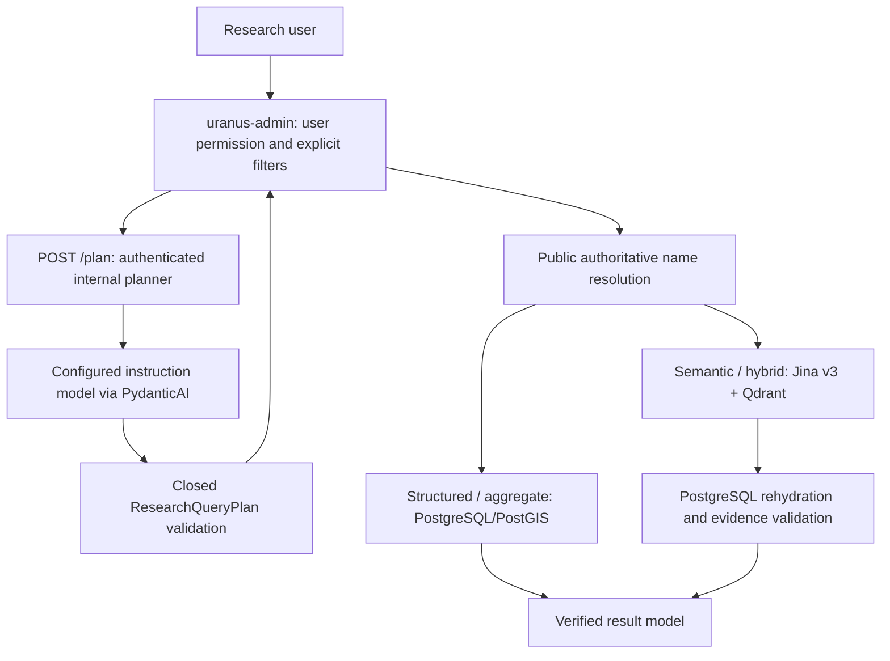

# Natural-language research: service contract and integration design

## Implemented boundary



This PR implements `/health`, `/ready`, `/plan`, model transport, contracts, prompt,
diagnostics, deployment examples and tests **in uranus-research-planner only**.
The resolver, executor, research result union, admin client and frontend are a
separate integration task. No code here connects to PostgreSQL, Qdrant or Jina.
The [baseline analysis](admin-baseline.md) records the verified main implementation.

The planner receives query/timezone/language only. No catalogs, private notes,
contacts, accounts, source credentials, candidate payloads or previous conversation
are passed to it. It interprets language; its output never establishes identity,
eligibility, quantity, accessibility or cultural value.

## Closed plan

The canonical contract is `src/research_planner/schemas.py::ResearchQueryPlan`;
[OpenAPI](../openapi.json) is generated from it and equality-tested. All plan fields
are required, nullable where appropriate. Unknown keys and coercion are rejected.
The model has no implicit wire defaults. `extra="forbid"`, strict validation and
all cross-field consistency checks remain active.

| Field | Allowed values / limits |
| --- | --- |
| `original_query` | Exact input; 1–2000 characters, nonblank |
| `intent` | search, list, count, aggregate, recommend, compare |
| `entity_type` | event, venue, organization |
| `semantic_query`, `semantic_focus` | Nullable, nonblank, at most 500 characters |
| `area_query`, `venue_query`, `organization_query` | Nullable names, at most 160 characters |
| `category_queries`, `genre_queries` | At most eight names each, 160 characters each |
| `temporal` | none, today, tomorrow, this_weekend, next_week, this_month, this_year, past, future, explicit_range |
| `explicit_from_date`, `explicit_to_date` | Both ordered ISO dates for explicit_range; otherwise null |
| `time_of_day` | none, evening |
| `metric` | none, event_count, occurrence_count, venue_count, organization_count |
| `group_by` | none, venue, area, organization, category |
| `comparison_targets` | At most four `{kind: venue/area/organization, query: name}` objects |
| `requires_semantic_relevance` | Strict boolean; true exactly when semantic_query is present |
| `answer_mode` | records, count, aggregate, recommendation, comparison; must match intent |
| `clarification` | none, needs_criteria, needs_location, needs_date |
| `unsupported_reason` | null, outside_research, multi_area, unsupported_constraint |

For record retrieval with only structured entities/filters and no residual condition,
use `intent=list` and `semantic_query=null`. `intent=search` requires a non-null
semantic_query; Pydantic rejects search without a residual. Existing list plans
with semantic content remain valid and must retain that condition during execution.
Count, aggregate, recommend and compare keep their intent-specific rules.

Counts require a metric compatible with entity type. Aggregates require grouping;
other intents cannot specify grouping. Recommendations require semantic preference
text. A comparison without clarification needs at least two distinct targets and a
metric. There are no UUID, SQL, confidence, tool, raw-field or reasoning fields.
NaN, Infinity, duplicate JSON keys, Markdown-wrapped JSON, truncated completions and
tool/chain-of-thought responses fail closed before framework parsing.

These checks establish shape and consistency, **not faithful interpretation**. A
syntactically valid model can still misunderstand a question. Show the understood
plan in the UI and evaluate the model on paraphrases before enabling the feature.

`entity_type` describes the requested result, never a filter's type. Counting
Veranstaltungen at Kühlhaus uses `event` plus `venue_query="Kühlhaus"`; listing
Veranstaltungen at Deutsches Haus also uses `event`. Listing Veranstaltungsorte
in Glücksburg uses `venue` plus `area_query="Glücksburg"`; counting them in
Flensburg uses `venue_count`. Asking for Organisationen uses `organization`.
These are interpretation rules, not permission to look up any names.

Unused `temporal`, `time_of_day`, `metric`, `group_by` and `clarification` must be
the string `"none"`, never null. Nullable text/date fields and `unsupported_reason`
use null when absent. `semantic_focus` is required even when null; only supply
text when semantic_query exists and an additional normalized preference is useful.
Qualitative or subjective conditions without a contract field stay in
semantic_query, including their negations and conjunctions; never add a new key.

The prompt contains this complete acceptance example, also checked against the
[golden fixtures](../../tests/fixtures/queries.json):

```json
{
  "original_query": "Wie viele Veranstaltungen waren im Kühlhaus?",
  "intent": "count",
  "entity_type": "event",
  "semantic_query": null,
  "area_query": null,
  "venue_query": "Kühlhaus",
  "organization_query": null,
  "category_queries": [],
  "genre_queries": [],
  "temporal": "past",
  "explicit_from_date": null,
  "explicit_to_date": null,
  "time_of_day": "none",
  "metric": "event_count",
  "group_by": "none",
  "comparison_targets": [],
  "semantic_focus": null,
  "requires_semantic_relevance": false,
  "answer_mode": "count",
  "clarification": "none",
  "unsupported_reason": null
}
```

For small local models, JSON Schema keeps simple length bounds; nonblank Query,
Slot and Topic validation runs in Pydantic because llama.cpp does not support
every regex feature. See the [schema audit](models.md#schema-audit-and-validation-boundary).
`json_schema` is preferred; `json_object` is only an explicit alternative.
Neither mode repairs invalid plans: invented keys, null enums, missing fields
and entity/metric conflicts still produce `planner_invalid_response` (502).
Offline contract tests cannot establish live model quality; run the separate
[operator acceptance tests](../deployment.md#manual-model-acceptance-after-merge).

## Provider and PydanticAI

`ResearchPlanner` is an async protocol with `plan`, `ready`, `close`.
`StructuredModelClient` implements it using PydanticAI's `Agent[None, ResearchQueryPlan]`,
`NativeOutput(..., strict=True)` and an explicit model/profile/provider. `json_object`
mode is an operator-selected alternative using `PromptedOutput`; there is no
automatic downgrade when a server rejects JSON Schema.

PydanticAI is used for typed structured output, provider separation and testability.
Its Agent object is not an autonomous research agent: request limit 1, tool-call
limit 0, no tools/toolsets, no history, retries 0, temperature 0, bounded max tokens.
SDK retries are also disabled. Telemetry instrumentation is explicitly disabled.
The small HTTP transport remains application-owned because generic SDKs do not
enforce the provider endpoint allowlist, byte-limit, redirect and log-redaction contract.

`pydantic-ai-slim[openai]` avoids unused provider integrations. The OpenAI SDK is pinned
to major 2 because major 3 switches its HTTP transport type; upgrades must retain
these tested boundaries. The operator chooses internal inference or the explicitly
allowlisted Groq API; the OpenAI SDK is a protocol adapter, not a choice of provider.
The [PydanticAI output documentation](https://ai.pydantic.dev/output/) explains native
versus prompted output. [Model choices](models.md) discuss the self-hosted server.

Jina v3 remains a query/passage encoder in admin. Embedding similarity does not
produce a closed intent/date/grouping plan. Adding a Jina intent classifier would
require an extra model operation without resolving slots, dates or consistency;
no classifier is introduced. No Qdrant document/index version changes are required.

## Two-stage interpretation and resolution (admin follow-up)

Stage A proposes `venue_query="Kühlhaus"`; Stage B obtains an actual public UUID from
PostgreSQL. The planner never chooses a candidate. Names are not authoritative
identifiers, even when the model appears certain.

Use explicit bounded resolution objects in admin:

```text
ResolvedEntityReference:
  kind: area | venue | organization | category | genre
  query: bounded original name
  status: none | exact | ambiguous | unresolved
  resolved_id/resolved_label: only populated from PostgreSQL for exact
  candidates: at most 10 public candidates
  has_more: boolean (a truncated list must never imply uniqueness)
```

Apply exact normalization consistently (Unicode/case/whitespace under a reviewed
policy); duplicate exact names remain ambiguous. Search near-matches can be shown
as candidates but cannot establish exact identity. Resolve with an extra row or a
separate uniqueness check before declaring exact; never infer uniqueness from a
truncated page. Use bounded parameterized queries and public projections only.

Areas come from `admin.research_area`; no Nominatim calls. Venues/organizations use
public Research eligibility. Do not reuse admin email/UUID search. Category/genre
names are proposals: only known exact taxonomy keys become hard filters; unknown
taxonomy terms remain semantic text, including on count/aggregate requests.

If an area/venue/organization is ambiguous or unknown, return `needs_resolution`.
Do not silently remove the fragment or choose the first candidate. Relative place
requests without a place produce `needs_clarification/needs_location` at planning.
An unspecified subjective comparison produces `needs_criteria`. No conversation
memory or multi-area interpretation is implemented.

Only after exact resolution may admin use `semantic_query` as the cleaned residual.
The original query remains intact. Unknown taxonomy fragments must be reattached
before semantic execution; if this makes a quantity request semantic, return the
semantic-count limitation. A proposed empty residual is not permission to ignore
an unresolved name.

## Temporal interpretation

Admin supplies `settings.event_timezone` (the service request defaults to
Europe/Berlin only for standalone callers). The service computes `reference_date`
once using a timezone-aware clock and returns it with the plan. Admin must use this
same date for resolution across midnight; do not independently recompute “today”.
Relative windows are executed in admin; no temporal database query occurs here.

Without a time reference, use `temporal=none`. German “gibt es”, “welche … gibt es”
and “es gibt” are present tense and do not imply past. “Gab es”, “waren”,
“fanden statt” and “were held” indicate past unless a more specific period is
given. Thus “Wie viele Veranstaltungsorte gibt es in Flensburg?” has no date
filter, whereas the same question with “gab es” uses past. Organization listings
follow the same distinction and use list when there is no semantic residual.

| Plan | Inclusive occurrence start-date window |
| --- | --- |
| none | No date restriction; no hidden future-only default |
| today | Local reference date |
| tomorrow | Local reference date plus one day |
| this_weekend | Saturday and Sunday of the reference date's ISO week; on Sunday includes Saturday |
| next_week | Monday through Sunday of the following ISO week |
| this_month | First through last day of the local calendar month |
| this_year | January 1 through December 31 of the local year |
| past | Start date strictly before the reference date; today's earlier events excluded |
| future | Start date on/after reference date, including today |
| explicit_range | Both supplied endpoints, inclusive; a single date uses equal endpoints |

This start-date rule matches existing Research date filters. It is not an overlap
query for multi-day events. Document any future change as a semantic contract
change. `evening` further requires a known local occurrence start time from 18:00
inclusive to before midnight; unknown/all-day times are not assumed to be evening.
The admin follow-up must implement this predicate before accepting such plans.
Other precise time-of-day constraints fail as unsupported. Ambiguous explicit dates
need clarification. DST boundaries must use calendar dates and the supplied zone,
not arbitrary 24-hour UTC offsets.

## Deterministic execution (admin follow-up)

Explicit UI filters take precedence over corresponding proposed plan slots. Apply
that precedence **before resolution**, show the override in the understood plan,
and retain other semantic/time requirements. Unknown or unsupported combinations
fail closed; never quietly drop them.

| Execution class | Authoritative behavior |
| --- | --- |
| STRUCTURED | PostgreSQL/PostGIS public projection, no embedding or Qdrant call |
| AGGREGATE | Fixed count/group SQL selected by enums, no Qdrant or Jina call |
| SEMANTIC | Jina/Qdrant candidate retrieval followed by PostgreSQL and evidence checks |
| HYBRID | Semantic pipeline plus exactly resolved structured restrictions |

All SQL identifiers/projections belong to reviewed repositories. No SQL is built
from arbitrary planner text. Use a dispatch service, not a large route handler.
Count/aggregate/quantitative comparison with semantic relevance must not enter an
exact-count branch. Search/list/recommend with semantic content use the same safe
retrieval pipeline (a `list` label must not discard a semantic constraint).

Area IDs must be passed identically to Qdrant and PostgreSQL. The same applies to
genre filters supported in both. Venue/organization/date restrictions remain
mandatory at PostgreSQL rehydration; propagate them to retrieval only where the
existing payload and filter implementation support the same semantics. Top-K
post-filtering can reduce recall and must not be represented as exhaustive search.
Semantic venue/organization retrieval is not yet the admin event-only API; return
an unsupported-plan error until corresponding execution paths are implemented.
The current admin semantic query limit is 120 characters; this service allows a
500-character semantic residual. The integration must either deliberately expand
that contract with tests or reject longer residuals explicitly, never truncate them.

Regression gate for the admin PR: “suche events in glücksburg” resolves one Research
Area and returns only eligible effective-location events there. Flensburg and
Harrislee cannot leak through semantic similarity. A venue-less “Late Night
Shopping” mentioning Glücksburg is excluded unless authoritative spatial semantics
qualify it. Mock planner fixtures here do not establish this database regression.

## Counts, aggregation and recommendations

`event_count` means `COUNT(DISTINCT event UUID)` across eligible public occurrences
in the selected period/filters. Repeated dates do not multiply an event. Explicit
`occurrence_count` counts distinct eligible occurrence UUIDs. Never count a Qdrant
Top-K list. Venue/organization counts count distinct public eligible entities under
the resolved constraints, with explicit repository support required in admin.

“Wo ist am meisten los?” defaults to event_count grouped by effective occurrence
venue, ordered count descending with stable label/ID tie-breakers. It measures
event volume, not attendance, popularity or quality. A touring event may contribute
once to several venues; group totals are not additive. Venue-less events need an
explicit unknown-location bucket or exclusion disclosed in the result contract.
Area grouping can likewise overlap; category grouping is many-to-many.

“Wie viele interessante Veranstaltungen …?” retains semantic relevance. There is
no evaluated absolute similarity threshold, so admin must return
`semantic_count_unavailable`. This also applies to semantically filtered aggregates
and quantitative comparisons. The service returns the plan only, never a number.

Recommendations express fit to the user's preference. A later answer can say
“Zu deiner Anfrage passen …”, not “objectively the most interesting events”.
Comparisons require independently resolved targets and comparable verified facts;
“better” without criteria triggers clarification. No subjective ranking is invented.

## Service response, errors and diagnostics

`POST /plan` returns a discriminated union: `kind=plan` or `kind=needs_clarification`.
Both include schema version, prompt version, configured model, original plan,
reference date, timezone and diagnostics. Internal responses are for trusted callers;
admin should expose a concise understood-plan projection and public candidate labels,
not provider metadata or internal IDs unless necessary.

| HTTP | Error code | Meaning |
| --- | --- | --- |
| 401 | unauthorized | Missing/incorrect service credential |
| 413 | request_too_large | More than 16 KiB request body |
| 422 | invalid_request | Invalid JSON/schema/timezone/query parameters |
| 422 | planner_unsupported_plan | Model marked an unrepresentable/private/out-of-domain request |
| 502 | planner_invalid_response | Invalid, inconsistent or unsafe model output |
| 503 | planner_unavailable | Disabled, saturated, timed out, unavailable or failed readiness |

All messages are fixed. No raw Pydantic errors, prompts, provider exceptions or
response bodies are returned/logged. There is no silent fallback to another mode.
Admin's explicitly selected existing semantic mode remains independent of `/plan`.
Resolution errors and `research_query_unavailable` are admin-owned future contracts.

Diagnostics: random per-request identifier (not a guessable query hash), model,
prompt version, planner intent, `planner_ms`, `total_ms`, safe error category.
No query, extracted names, semantic text, evidence, tokens, keys or model output is
logged. SDK debug-body logging and agent instrumentation are disabled. Access logs
are disabled in supplied launch templates. Downstream inference/proxy logging must
also be configured without bodies or credentials by the operator.

Admin should add `resolution_ms`, `retrieval_ms`, `postgres_ms`, optional `answer_ms`
and a complete funnel: raw Qdrant points → grouped candidates → PostgreSQL eligible
→ context-valid → final results. These are not measured by this service because
it does not perform those stages. No confidence percentage is introduced.

## Security, lifecycle and deployment

Two separate keys: incoming service authentication and outgoing model authentication.
The browser never receives the model provider key or controls provider configuration.
The internal provider requires a numeric loopback/RFC1918/IPv6 ULA address, explicit
port and `/v1` API path; there is no DNS lookup. HTTP is loopback-only; remote private
addresses require verified TLS. For named AI hosts use a separately provisioned
SSH tunnel to loopback. The groq provider accepts only the exact
`https://api.groq.com/openai/v1` base, using DNS and verified TLS. This explicit
exception does not enable arbitrary public URLs. Both policies reject URL credentials,
unexpected paths, query strings, fragments, redirects and environment proxies.

A shared immutable ModelEndpoint policy constructs the SDK base, completion and
readiness URLs and validates every outgoing method/full URL before credentials
are attached. Only `POST <base_url>/chat/completions` and `GET <base_url>/models`
are permitted. All configuration is operator-side; the public request and response
contracts, ResearchQueryPlan v1 and prompt v3 remain unchanged. Choosing Groq
sends the prompt and query context externally, never live records or entity lookups.
Firewall and host egress remain operator responsibilities; no infrastructure is changed.

64 KiB model request, 32 KiB model response, no compressed responses, 1200 default
output tokens, eight-second default total model deadline, two concurrent requests
and no application queue. Readiness has a two-second budget and checks the configured
model ID, not inference quality or schema support. A deployment smoke test must
verify native JSON Schema support. See [deployment](../deployment.md).

## Query → plan examples

Fields not shown are null/empty/none as required by the full schema.

| Query | Interpretation |
| --- | --- |
| Events in Glücksburg | list; area_query=Glücksburg; no semantic residual |
| Kunst in Glücksburg | search; area_query=Glücksburg; semantic_query=Kunst |
| Wie viele Events gibt es in Flensburg? | count; area_query=Flensburg; event_count |
| Wie viele Veranstaltungen waren im Kühlhaus? | count; venue_query=Kühlhaus; past; event_count |
| Was ist heute kulturell besonders spannend? | recommend; today; semantic_query=kulturell besonders spannend |
| Wo ist dieses Wochenende am meisten los? | aggregate; this_weekend; event_count; group_by=venue |
| Kreative Angebote für Jugendliche in Glücksburg | search; area_query=Glücksburg; semantic relevance |
| Veranstaltungen über Glücksburg | semantic topic, no automatic area filter |
| Veranstaltungen von Stadt Glücksburg | organization_query=Stadt Glücksburg; no automatic area filter |
| Was kann ich heute Abend in Flensburg machen? | recommend; today; evening; area_query=Flensburg |
| Welcher Ort ist besser? | compare; needs_criteria |

## Answer generation boundary and remaining work

No `/answer` endpoint is implemented. A future answer provider accepts only a
validated plan and a bounded caller-owned DTO of verified public facts/evidence.
It must have the same no-tool/no-network restrictions and cannot retrieve data.
Counts should initially use deterministic templates. The admin service must verify
that any cited record belongs to its final result before publishing generated text.

Next PR in admin: authenticated planner client; explicit-filter precedence; bounded
public resolvers; temporal resolution; allowlisted count/aggregate repositories;
structured/semantic/hybrid dispatch; evidence-safe results; understood-plan and
ambiguity UI; Pydantic/Zod/proxy/OpenAPI updates; DB/permission/filter regression tests.
Before rollout: evaluate real DE/DA/EN paraphrases, injection attempts, quantization,
slot accuracy and p50/p95 latency on the actual host. No live accuracy or latency
claim can be inferred from the offline fixture tests in this PR.
